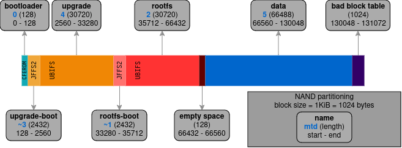

The goal is to flash an open firmware or to gain root access on a NB6VAC router.
Any help welcome!

| NOTE                       |
|:---------------------------|
| _Reading this README reflects the act of reverse engineering: you need to find order in apparent chaos. Good luck!_ |

# Material

| Router                | Value                  |
|-----------------------|------------------------|
| Model                 | NB6VAC-FXC-r1          |
| Firmware              | `NB6VAC-MAIN-R4.0.45d` |
| Emergency firmware    | `NB6VAC-MAIN-R4.0.44k` |


| | |
|:---------------------:|:----------------------:|
|                       |                        |

# Forensics on the serial console at boot

This is a work in progress.
Verbosity is intended.
Trying to follow along an expert's method on a [similar project](https://github.com/digiampietro/hacking-gemtek).

Let's start looking at what the serial console prints when booting:

* The boot loader is CFE version 1.0.39

```console
CFE version 1.0.39-116.174 for BCM963268 (32bit,SP,BE)
```
[https://openwrt.org/docs/techref/bootloader/cfe](https://openwrt.org/docs/techref/bootloader/cfe)

* The CPU is a BCM63168D0 (400MHz), MIPS architecture. The NAND flash chip is 128 mibibytes (128 MiB = 131072 KiB = 134217728 bytes). Here are some more parameters:

```console
Boot Strap Register:  0x1ff97bf
Chip ID: BCM63168D0, MIPS: 400MHz, DDR: 400MHz, Bus: 200MHz
Main Thread: TP0
Memory Test Passed
Total Memory: 134217728 bytes (128MB)
Boot Address: 0xb8000000

NAND ECC BCH-4, page size 0x800 bytes, spare size used 64 bytes
NAND flash device: , id 0xeff1 block 128KB size 131072KB
...
Broadcom NAND controller (BrcmNand Controller)
mtd->oobsize=0, mtd->eccOobSize=0
NAND_CS_NAND_XOR=00000000
B4: NandSelect=40000001, nandConfig=15142200, chipSelect=0
brcmnand_read_id: CS0: dev_id=eff10095
After: NandSelect=40000001, nandConfig=15142200
DevId eff10095 may not be supported.  Will use config info
Spare Area Size = 16B/512B
Block size=00020000, erase shift=17
NAND Config: Reg=15142200, chipSize=128 MB, blockSize=128K, erase_shift=11
busWidth=1, pageSize=2048B, page_shift=11, page_mask=000007ff
timing1 not adjusted: 6574845b
timing2 not adjusted: 00001e96
ECC level changed to 4
OOB size changed to 16
BrcmNAND mfg 0 0 UNSUPPORTED NAND CHIP 128MB on CS0

Found NAND on CS0: ACC=e3441010, cfg=15142200, flashId=eff10095, tim1=6574845b, tim2=00001e96
BrcmNAND version = 0x0400 128MB @00000000
brcmnand_scan: B4 nand_select = 40000001
brcmnand_scan: After nand_select = 40000001
handle_acc_control: default CORR ERR threshold  1 bits
ACC: 16 OOB bytes per 512B ECC step; from ID probe: 16
page_shift=11, bbt_erase_shift=17, chip_shift=27, phys_erase_shift=17
Brcm NAND controller version = 4.0 NAND flash size 128MB @18000000
ECC layout=brcmnand_oob_bch4_2k
brcmnand_scan:  mtd->oobsize=64
brcmnand_scan: oobavail=35, eccsize=512, writesize=2048
brcmnand_scan, eccsize=512, writesize=2048, eccsteps=4, ecclevel=4, eccbytes=7
-->brcmnand_default_bbt
brcmnand_default_bbt: bbt_td = bbt_slc_bch4_main_descr
Bad block table Bbt0 found at page 0000ffc0, version 0x01 for chip on CS0
Bad block table 1tbB found at page 0000ff80, version 0x01 for chip on CS0
brcmnand_reset_corr_threshold: default CORR ERR threshold  1 bits for CS0
brcmnand_reset_corr_threshold: CORR ERR threshold changed to 3 bits for CS0
brcmnandCET: Status -> Deferred
```

[https://openwrt.org/docs/techref/hardware/soc/soc.broadcom.bcm63xx](https://openwrt.org/docs/techref/hardware/soc/soc.broadcom.bcm63xx)

* The OTP memory chip is a [C8051T634](https://www.keil.com/dd/docs/datashts/silabs/c8051t63x.pdf). 
OTP stands for "One Time Programmable".
It could store factory settings such as keys (see section [About CFE secure boot](#About-CFE-Secure-Boot)).

```console
[    0.611000] sb1_mcu: [MCUProtocolInitialize] OTP MCU (C8051T634) detected.
```

* There are multiple WiFi devices (identified by `wl0` and `wl1`), probably for the 2.4GHz and 5GHz frequencies.
Chips could be a Broadcom BCM43602 (wl0) and a Broadcom BCM435f (wl1).
The dhd (dongle host driver) has been compiled with OpenWRT.
There are lines I don't understand but that could be of interest (checking a resource availability in SPROM and OTP; updating SROM from flash if not found; ...).

```console
[   21.068000] Dongle Host Driver, version 7.14.89.14.cpe4.16L03.0-kdb
[   21.068000] Compiled from /home/crd/dev/trunk-next/openwrt/build_dir/linux-nova_sb1_sfr/broadcom-dhd/dhd//dhd/sys/dhd_common.c
[   21.068000] Compiled on Jan 23 2022 at 21:14:37
[   21.102000] +++++ Added gso loopback support for dev=wl0 <85023800>
[   21.113000] nvram_get_internal: variable boardrev defaulted to 0x10
[   21.125000] dhdpcie_download_code_file: download firmware /etc/wlan/dhd/43602a1/rtecdc.bin
[   21.583000] Neither SPROM nor OTP has valid image
[   21.588000] wl:srom/otp not programmed, using main memory mapped srom info(wombo board)
[   21.597000] wl: ID=pci/2/0/
[   21.600000] wl: ID=pci/2/0/
[   21.605000] wl: loading /etc/wlan/bcm43602_map.bin
[   21.610000] wl: updating srom from flash...
[   21.614000] srom rev:11
[   21.629000] dhdpcie_bus_write_vars: Download, Upload and compare of NVRAM succeeded.
[   21.682000] PCIe shared addr (0x001e8b0c) read took 42023 usec before dongle is ready
...
[   22.055000] CONSOLE: 000000.036 wl0: Broadcom BCM43602 802.11 Wireless Controller 7.35.177.83 (r669233)
...
[   24.360000] wl1: Broadcom BCM435f 802.11 Wireless Controller 7.14.89.14.cpe4.16L03.0-kdb
```

* CFE offers an interactive menu when a key is pressed from the serial at startup. It has interesting functions. For example, you can dump memory content (see section [NAND Dump](#NAND-Dump)), change boot parameters, try to run images from a TFTP server, etc. We could make further good use of this.

```console
*** Press any key to stop auto run (1 seconds) ***
CFE> help
Available commands:

fe                  Erase a selected partition of the flash (use fi to display informations).
fi                  Display informations about the flash partitions.
fb                  Find NAND bad blocks
dn                  Dump NAND contents along with spare area
phy                 Set memory or registers.
sm                  Set memory or registers.
dm                  Dump memory or registers.
db                  Dump bytes.
dh                  Dump half-words.
dw                  Dump words.
ww                  Write the 2 partition, you must choose the 0 wfi tagged image.
w                   Write the whole image with wfi_tag on the previous partition if wfiFlags field in tag is set to default
e                   Erase NAND flash
ws                  Write whole image (priviously loaded by kermit) to flash .
r                   Run program from flash image or from host depend on [f/h] flag
p                   Print boot line and board parameter info
c                   Change booline parameters
i                   Erase persistent storage data
a                   Change board AFE ID
b                   Change board parameters
reset               Reset the board
pmdio               Pseudo MDIO access for external switches.
spi                 Legacy SPI access of external switch.
force               override chipid check for images.
help                Obtain help for CFE commands
```

* The kernel is probably lzma compressed (infered from `binwalk`), and is authenticated before decompression.
There are useful memory addresses at that stage.
The latest boot image starts at `0xba080000` with a flash offset of `0x02080000`. 

```console
Boot Nand Image using OOB Tag
Booting from latest image (address 0xba080000, flash offset 0x02080000) ...
Authenticating vmlinux.lz ... pass
Decompression OK!
Entry at 0x80351e30
Starting program at 0x80351e30
```

The flash offset `0x02080000` corresponds to the location of a JFFS2 filesystem (big endian) on the NAND (byte `34078720`). 
This is observed applying `binwalk` to the full dump (note that `0x02` == `0x2` in hexa):

```console
$ binwalk MY-DUMP-FXC-r1-4.0.45d

DECIMAL       HEXADECIMAL     DESCRIPTION
...
34078720      0x2080000       JFFS2 filesystem, big endian
```

The starting program is the kernel. It is entered at `0x80351e30`.

* Kernel version is `3.4.11-rt19` (_rt_ means real-time) with command line `ro noinitrd  console=ttyS0,115200 earlyprintk debug irqaffinity=0`.
The CPU instruction set is `Broadcom BMIPS4350`.

```console
Starting program at 0x80351e30
[    0.000000] Linux version 3.4.11-rt19 (crd@docker-fortycore2) (gcc version 4.7.0 (GCC) ) #2 SMP PREEMPT Sun Jan 23 21:26:31 UTC 2022
...
[    0.000000] CPU revision is: 0002a080 (Broadcom BMIPS4350)
...
[    0.019000] --Kernel Config--
[    0.020000]   SMP=1
[    0.021000]   PREEMPT=1
[    0.022000]   DEBUG_SPINLOCK=0
[    0.023000]   DEBUG_MUTEXES=0
```

Kernel build number is `#2`. 
It is built to function on a multiprocessor computer (`SMP`; for Symmetric Multi-Processing).
The kernel is preemptible (`PREEMPT`), meaning it can be interrupted in the middle of executing code to handle other threads.
You can take a look at the extracted kernel configuration file [here](misc/kernel_config).

* The root filesystem is a `ubifs filesystem` :

```console
[    1.957000] VFS: Mounted root (ubifs filesystem) readonly on device 0:11.
```

* The 128MiB NAND device is partitioned as follow:

```console
[    0.894000] Creating 6 MTD partitions on "brcmnand.0":
[    0.899000] 0x000000000000-0x000000020000 : "bootloader"
[    0.907000] 0x000002080000-0x0000040e0000 : "rootfs-image"
[    0.915000] 0x0000022e0000-0x0000040e0000 : "rootfs"
[    0.923000] 0x000000020000-0x000002080000 : "upgrade-image"
[    0.931000] 0x000000280000-0x000002080000 : "upgrade"
[    0.938000] 0x000004100000-0x000007f00000 : "data"
```

Here is a transposition of the above partition table in number of blocks of 1024 bytes (= 1KiB = 1 kibibyte):

```console
  P   Device  Start    End    Length   Name
  -   ------ ------- -------- -------- ------------
  1   mtd0        0      128      128  bootloader
  2   mtd1   33,280   66,432   33,152  rootfs-image
  3   mtd2   35,712   66,432   30,720  rootfs
  4   mtd3      128   33,280   33,152  upgrade-image
  5   mtd4    2,560   33,280   30,720  upgrade
  6   mtd5   66,560  130,048   66,488  data
```

I know nothing about MTD or UBIFS, but we can see overlaps of `30720` blocks between `*-images` and their matching filesystems.
For example, `rootfs-image` and `rootfs` both ends at block `66432`, but `rootfs-image` starts earlier, containing a portion of `2432` unshared blocks with `rootfs` (2490368 bytes). The same goes for `upgrade-image` and `upgrade`.

Extracting those unshared portions from `rootfs-image` and `upgrade-image` with `dd`, we can see they perfectly match JFFS2 partitions contained in some official firmwares (`cferam.000` + `secram.000` + `vmlinux.lz` + `vmlinux.sig`).
Respectively, `rootfs-image` and `upgrade-image`  match firmwares `4.0.45d` and `4.0.44k`.
Notice that `4.0.45d` is the main firmware of this router, and `4.0.44k` the emergency firmware.

```console
$ dd if=MY_DUMP of=rootfs-image-jffs2 skip=128 count=2432 bs=1024
$ dd if=NB6VAC-MAIN-R4.0.45d of=firmware-4.04.45d-jffs2 count=2432 bs=1024
$ diff -s firmware-4.04.45d-jffs2 rootfs-image-jffs2
Files firmware-4.04.45d-jffs2 and rootfs-image-jffs2 are identical
```

Further comparisons could be interesting.

* NAND representation (**not the partition table!**)

Reordering the above table, considering images with only their unshared slices, and taking empty spaces into accounts gives us the new following table:

```console
 P   Device  Start    End    Length   Name
--  ------ ------- -------- -------- ------------
 1   mtd0        0      128      128  bootloader
 2  ~mtd3      128    2,560    2,432  upgrade-image [part1]
 3   mtd4    2,560   33,280   30,720  upgrade       (and upgrade-image [part2])
 4  ~mtd1   33,280   35,712    2,432  rootfs-image  [part1]
 5   mtd2   35,712   66,432   30,720  rootfs        (and rootfs-image [part2])
 6    -     66,432   66,560      128  empty space
 7   mtd5   66,560  130,048   66,488  data
 8    -    130,048  131,072    1,024  bbt (bad block table see CFE below)
```

In this table and the diagram below, the tidle `~` before a mtd device indicates we have truncated its end block address (ignoring overlaping data with its filesystem).
Be cautious not to interpret this as the real partitioning table (see above).



The `fi` command in the CFE interactive menu also informs us about NAND partitions:

```console
CFE> fi
0 : boot    offset=0x00000000, size=131072 (128 ko), block=1
1 : rootfs1 offset=0x00020000, size=33947648 (32 Mo), blocks=259
2 : rootfs2 offset=0x02080000, size=33947648 (32 Mo), blocks=259
3 : data    offset=0x04100000, size=65011712 (62 Mo), blocks=496
4 : bbt     offset=0x07f00000, size=1048576 (1024 ko), blocks=8
flash_end   offset=0x07f00400, blocks=1024
```

On the filesystem, `/etc/fstab` is simply populated with:

```console
proc	/proc		proc	defaults	0 0
none	/dev/pts	devpts	defaults	0 0
sysfs	/sys		sysfs	defaults	0 0
tmpfs	/tmp		tmpfs	defaults,mode=1777	0 0
```

* UBIFS Markers are announced `256` bytes before the `rootfs` and `upgrade` start.

```console
[    0.872000] ***** Found UBIFS Marker at 0x022dff00
[    0.889000] ***** Found UBIFS Marker at 0x0027ff00
```

An extracted UBIFS Marker looks like this: four times the string `BcmFs-ubifs.` (`42 63 6d 46 73 2d 75 62 69 66 73 00`).

```console
$ dd if=MY_DUMP of=rootfs-image_ubifs-marker bs=1 skip=$(( (35712 * 1024) - 256)) count=256
256+0 records in
256+0 records out
256 bytes copied, 0.000307293 s, 833 kB/s

$ hexdump -C rootfs-image_ubifs-marker
00000000  42 63 6d 46 73 2d 75 62  69 66 73 00 42 63 6d 46  |BcmFs-ubifs.BcmF|
00000010  73 2d 75 62 69 66 73 00  42 63 6d 46 73 2d 75 62  |s-ubifs.BcmFs-ub|
00000020  69 66 73 00 42 63 6d 46  73 2d 75 62 69 66 73 00  |ifs.BcmFs-ubifs.|
00000030  ff ff ff ff ff ff ff ff  ff ff ff ff ff ff ff ff  |................|
*
00000100
```

* Partition 3 (mtd2; rootfs) is a UBI file system using `zlib` compression attached to `ubi0` (UBI device 0, volume 0, name = "rootfs_ubifs").

```console
[    0.947000] UBI: attaching mtd2 to ubi0
[    0.950000] UBI: physical eraseblock size:   131072 bytes (128 KiB)
[    0.957000] UBI: logical eraseblock size:    126976 bytes
[    0.962000] UBI: smallest flash I/O unit:    2048
[    0.967000] UBI: VID header offset:          2048 (aligned 2048)
[    0.973000] UBI: data offset:                4096
[    1.290000] UBI: max. sequence number:       2
[    1.313000] UBI: attached mtd2 to ubi0
[    1.316000] UBI: MTD device name:            "rootfs"
[    1.321000] UBI: MTD device size:            30 MiB
[    1.326000] UBI: number of good PEBs:        240
[    1.331000] UBI: number of bad PEBs:         0
[    1.336000] UBI: number of corrupted PEBs:   0
[    1.340000] UBI: max. allowed volumes:       128
[    1.345000] UBI: wear-leveling threshold:    4096
[    1.350000] UBI: number of internal volumes: 1
[    1.355000] UBI: number of user volumes:     1
[    1.359000] UBI: available PEBs:             0
[    1.364000] UBI: total number of reserved PEBs: 240
[    1.369000] UBI: number of PEBs reserved for bad PEB handling: 2
[    1.375000] UBI: max/mean erase counter: 1/0
[    1.379000] UBI: image sequence number:  1558008590
[    1.384000] UBI: background thread "ubi_bgt0d" started, PID 235
...
[    1.912000] UBIFS: mounted UBI device 0, volume 0, name "rootfs_ubifs"
[    1.918000] UBIFS: mounted read-only
[    1.921000] UBIFS: file system size:   28315648 bytes (27652 KiB, 27 MiB, 223 LEBs)
[    1.929000] UBIFS: journal size:       9023488 bytes (8812 KiB, 8 MiB, 72 LEBs)
[    1.937000] UBIFS: media format:       w4/r0 (latest is w4/r0)
[    1.943000] UBIFS: default compressor: zlib
[    1.947000] UBIFS: reserved for root:  0 bytes (0 KiB)
```

* Partition 6 (mtd5; data) is a UBI file system using `lzo` compression attached to `ubi1` (UBI device 1, volume 0, name = "data_ubifs").

```console
[    2.775000] UBI: attaching mtd5 to ubi1
[    2.778000] UBI: physical eraseblock size:   131072 bytes (128 KiB)
[    2.784000] UBI: logical eraseblock size:    126976 bytes
[    2.790000] UBI: smallest flash I/O unit:    2048
[    2.795000] UBI: VID header offset:          2048 (aligned 2048)
[    2.801000] UBI: data offset:                4096
[    3.449000] UBI: max. sequence number:       543
[    3.473000] UBI: attached mtd5 to ubi1
[    3.476000] UBI: MTD device name:            "data"
[    3.481000] UBI: MTD device size:            62 MiB
[    3.486000] UBI: number of good PEBs:        496
[    3.491000] UBI: number of bad PEBs:         0
[    3.496000] UBI: number of corrupted PEBs:   0
[    3.500000] UBI: max. allowed volumes:       128
[    3.505000] UBI: wear-leveling threshold:    4096
[    3.510000] UBI: number of internal volumes: 1
[    3.514000] UBI: number of user volumes:     1
[    3.519000] UBI: available PEBs:             0
[    3.524000] UBI: total number of reserved PEBs: 496
[    3.529000] UBI: number of PEBs reserved for bad PEB handling: 4
[    3.535000] UBI: max/mean erase counter: 3/1
[    3.539000] UBI: image sequence number:  1307933915
[    3.544000] UBI: background thread "ubi_bgt1d" started, PID 325
[    3.928000] UBIFS: recovery needed
[    4.186000] UBIFS: recovery completed
[    4.189000] UBIFS: mounted UBI device 1, volume 0, name "data_ubifs"
[    4.196000] UBIFS: file system size:   60821504 bytes (59396 KiB, 58 MiB, 479 LEBs)
[    4.204000] UBIFS: journal size:       3047424 bytes (2976 KiB, 2 MiB, 24 LEBs)
[    4.211000] UBIFS: media format:       w4/r0 (latest is w4/r0)
[    4.217000] UBIFS: default compressor: lzo
[    4.222000] UBIFS: reserved for root:  2872749 bytes (2805 KiB)
```

* In **between** mtd2 (ubi0) and mtd5 (ubi1) mounting, unused kernel memory is freed and "pre init" scripts are executed:

```console
...
[    1.957000] VFS: Mounted root (ubifs filesystem) readonly on device 0:11.
[    1.967000] devtmpfs: mounted
[    1.971000] Freeing unused kernel memory: 204k freed
[    2.340000] [INFO] # - pre init -
[    2.719000] [_OK_] # /etc/init.d/early-devices boot
[    2.753000] [INFO] - flash union...
[    2.775000] UBI: attaching mtd5 to ubi1
...
```

Let's quickly deviate from serial console to look at those "pre init" scripts.
The most interesting script is the first called: `/etc/preinit`. It sources a bunch of logging functions from `/etc/functions` then executes this:

```console
mount proc /proc -t proc
mount sysfs /sys -t sysfs
hinfo "- pre init -"
/etc/init.d/early-devices boot
```

`/etc/init.d/early-devices boot` calls `/etc/rc.common`, which in turns calls back `/etc/init.d/early-devices start`. 
Here is a transformed but relevant portion of code detailing its actions:

```console
# /etc/init.d/early-devices start

# Make devices nodes:
mknod /dev/gmac c 249 0
mknod -m 640 /dev/bpm c 244 0
mknod -m 666 /dev/bcmendpoint0 c 209 0
mknod /dev/brcmboard c 206 0

# MTD symlinks
# create MTD link: bootloader
chmod a+w /dev/mtd0
chmod a+w /dev/mtdblock0
ln -sf /dev/mtd0 /dev/mtd-bootloader
ln -sf /dev/mtdblock0 /dev/mtdblock-bootloader

# create MTD link: rootfs
ln -sf /dev/mtd2 /dev/mtd-rootfs
ln -sf /dev/mtdblock2 /dev/mtdblock-rootfs

# create MTD link: rootfs-image
ln -sf /dev/mtd1 /dev/mtd-rootfs-image
ln -sf /dev/mtdblock1 /dev/mtdblock-rootfs-image

# create MTD link: upgrade
ln -sf /dev/mtd4 /dev/mtd-upgrade
ln -sf /dev/mtdblock4 /dev/mtdblock-upgrade

# create MTD link: upgrade-image
ln -sf /dev/mtd3 /dev/mtd-upgrade-image
ln -sf /dev/mtdblock3 /dev/mtdblock-upgrade-image

# create MTD link: data
chmod a+w /dev/mtd5
chmod a+w /dev/mtdblock5
ln -sf /dev/mtd5 /dev/mtd-data
ln -sf /dev/mtdblock5 /dev/mtdblock-data
```

Notice write permissions for all users (`chmod a+w`) are added to `bootloader` and `data`'s respective devices (`/dev/mtd{0,5}` and `/dev/mtdblock{0,5}`).

**NOTE**: part numbers for `/dev/mtdXXX` are infered from our partition table, but might be different on the running router.
Here is the function used in the script to extract them: 

```console
part_number=$(grep "\"$2\"" /proc/mtd|sed 's/^mtd\(.*\):.*/\1/')
if [ -z "$part_number" ]
then
    return
else
    create MTD link ...
fi
```

`$2` being the partition name (`bootloader`, `rootfs`, `rootfs-image`, `upgrade`, `upgrade-image`, or `data`).
Also note that if there is no match for `grep "$2" /proc/mtd` the symbolic links are not created.

The main script `/etc/preinit` then looks for an executable that I could not find in any firmware or filesystem I have extracted (a lot): `/usb/bin/usb-boot`.
If it fails (and it will), it proceeds with the `flash_union` function that could be of interest later.
It's already hard to keep it short, but basically, it mounts `data_ubifs` to `/overlay`:

```console
ubiattach /dev/ubi_ctrl -m 5 -d 1
mount -t ubifs -o noatime ubi1:data_ubifs /overlay/
```

Continuing with `/etc/preinit`, there are switches between directories, and noticably a `pivot_root` between `/root` and `/rom`:

```console
mount -t overlayfs overlayfs -olowerdir=/,upperdir=/overlay /root
cd /root
pivot_root . rom
mount -o move /rom/dev /dev 2>&-
mount -o move /rom/proc /proc 2>&-
mount -o move /rom/sys /sys 2>&-
mount -o move /rom/overlay/ /overlay 2>&-
```

Finally, `/etc/preinit` will fail to find another executable (`/sbin/bootchartd`) before starting `/sbin/init` which is, in fact, Busybox:

```console
if [ -x /sbin/bootchartd ]; then
    exec /usr/sbin/chroot . /sbin/bootchartd
else
    exec /usr/sbin/chroot . /sbin/init
fi
```

Let's go back to the serial console.

* Init program is `BusyBox 1.22.1`

```console
[    4.347000] init started: BusyBox v1.22.1 (2022-01-23 21:14:10 UTC)
```

It immediately proposes a console we can interact with (while the boot process continues):

```
Please press Enter to activate this console.

[NB6VAC-FXC-r1][NB6VAC-MAIN-R4.0.45d][NB6VAC-XDSL-A2pv6F039p]
nb6vac login: root
Password: 
Login incorrect
```

We will take a look later to `/etc/shadow` in the filesystem which contains a `root` user and its hashed password.

* After Busybox, scripts continue to be called in that order (leaving it here just in case):

```console
[   10.107000] [_OK_] # /etc/rc.d/S10boot boot
[   10.160000] [_OK_] # /etc/rc.d/S11watchdog boot
[   10.212000] [_OK_] # /etc/rc.d/S12usb boot
[   10.288000] [_OK_] # /etc/rc.d/S20cron boot
[   10.336000] [_OK_] # /etc/rc.d/S21dropbear boot
[   10.413000] [_OK_] # /etc/rc.d/S21plc-detect boot
[   10.470000] [_OK_] # /etc/rc.d/S22inetd boot
[   10.616000] [_OK_] # /etc/rc.d/S23syslog-ng boot
[   10.693000] kernel.hotplug = /sbin/hotplug-call
[   10.956000] [_OK_] # /etc/rc.d/S24hotplug boot
[   11.768000] input: uinput-neufbox as /devices/virtual/input/input1
[   12.350000] [_OK_] # /etc/rc.d/S25nbd boot
[   12.485000] net.nf_conntrack_max = 16384
[   12.491000] [_OK_] # /etc/rc.d/S26sysctl boot
[   12.870000] [_OK_] # /etc/rc.d/S30eco boot
[   13.324000] [_OK_] # /etc/init.d/dnsmasq reload
[   13.359000] [_OK_] # /etc/rc.d/S31hosts boot
[   18.174000] [_OK_] # /etc/rc.d/S32firewall boot
[   19.619000] [INFO] # boot phy
...
[   31.113000] [_OK_] # /etc/rc.d/S34phy boot
[   31.226000] bcmxtmcfg: bcmxtmcfg_init entry
[   31.257000] [_OK_] # /etc/rc.d/S35xtm boot
[   31.982000] NB6VAC-XDSL-A2pv6F039p [fw - size:983k cc:367b34d8h]
...
[   32.843000] [_OK_] # /etc/init.d/xtm start
[   32.865000] [_OK_] # /etc/rc.d/S36adsl boot
...
[   48.792000] [_OK_] # /etc/rc.d/S37topology boot
[   51.037000] [_OK_] # /etc/rc.d/S38qos boot
...
[   51.290000] [_OK_] # /etc/rc.d/S39data boot
[   51.390000] [_OK_] # /etc/rc.d/S40ppp-xdsl boot
[   51.852000] [_OK_] # /etc/rc.d/S41dhcpc boot
[   51.989000] [_OK_] # /etc/rc.d/S42ipv6 boot
[   53.177000] [_OK_] # /etc/rc.d/S43lan boot
[   53.312000] [_OK_] # /etc/rc.d/S44route boot
[   53.459000] [_OK_] # /etc/rc.d/S49wol boot
[   53.800000] [_OK_] # /etc/rc.d/S50miniupnpd boot
[   53.948000] [_OK_] # /etc/rc.d/S51lan-topology boot
[   54.045000] iptables: Bad rule (does a matching rule exist in that chain?).
[   54.484000] [_OK_] # /etc/rc.d/S52dnsmasq boot
[   54.593000] sh: 44k: bad number
...
[   67.749000] [_OK_] # /etc/rc.d/S53wlan boot
[   67.904000] [_OK_] # /etc/rc.d/S54wifisched boot
[   68.590000] RTNETLINK answers: File exists
[   68.612000] [_OK_] # /etc/rc.d/S55hotspot boot
[   68.751000] 1970-01-01 00:01:08: (network.c.252) warning: please use server.use-ipv6 only for hostnames, not without server.bind / empty address; your config will break if the kernel default for IPV6_V6ONLY changes
[   68.778000] [_OK_] # /etc/rc.d/S55lighttpd boot
[   69.145000] RTNETLINK answers: File exists
[   69.367000] [_OK_] # /etc/rc.d/S56guest boot
[   69.634000] [_OK_] # /etc/rc.d/S57iptv boot
[   69.709000] [_OK_] # /etc/rc.d/S58voip boot
[   75.102000] [_OK_] # /etc/rc.d/S59ont boot
[   75.207000] [_OK_] # /etc/rc.d/S99boot-terminated boot
```

And the boot process is over.

# Open ports and protocols

Further exploration when the router is up and running.

| Protocol | Port   |
|:---------|:------:|
|http      |`80`    | 
|telnet    |`1287`  | 
|ssh       |`1288`  | 
|upnp      |`49152` | 

### Shaking the router with `nmap`

See [nmap.log](https://github.com/dougy147/nb6vac/tree/master/logs/nmap.log) for full log.

```console
$ nmap -p0- -Pn -v -A -T4 192.168.1.1
Scanning 192.168.1.1 [1 port]
sendto in send_ip_packet_sd: sendto(6, packet, 44, 0, 192.168.1.1, 16) => Operation not permitted
Offending packet: TCP localhost:42087 > 192.168.1.1:53 S ttl=57 id=39784 iplen=44  seq=2250069918 win=1024 <mss 1460>
sendto in send_ip_packet_sd: sendto(6, packet, 44, 0, 192.168.1.1, 16) => Operation not permitted
Offending packet: TCP localhost:42089 > 192.168.1.1:53 S ttl=41 id=16251 iplen=44  seq=2250200988 win=1024 <mss 1460>
Discovered open port 80/tcp on 192.168.1.1
Discovered open port 1288/tcp on 192.168.1.1
Discovered open port 49152/tcp on 192.168.1.1
Discovered open port 1287/tcp on 192.168.1.1
WARNING: Service 192.168.1.1:49152 had already soft-matched upnp, but now soft-matched rtsp; ignoring second value
WARNING: Service 192.168.1.1:49152 had already soft-matched upnp, but now soft-matched sip; ignoring second value
Initiating OS detection (try #1) against 192.168.1.1
PORT      STATE SERVICE     VERSION
80/tcp    open  http        lighttpd
|_http-server-header: Server
|_http-title: Box -&nbsp;Accueil
|_http-favicon: Unknown favicon MD5: 94D3927A1DC46C1DAF81F8A48D49BC43
| http-methods:
|   Supported Methods: GET POST PUT DELETE OPTIONS HEAD
|_  Potentially risky methods: PUT DELETE
1287/tcp  open  routematch?
| fingerprint-strings:
|   NULL:
|_    diaglog[4093] [push/] aborted: no default route defined
1288/tcp  open  ssh         Dropbear sshd 2014.65 (protocol 2.0)
49152/tcp open  upnp        MiniUPnP 1.9 (UPnP 1.1)
| fingerprint-strings:
...
2 services unrecognized despite returning data. If you know the service/version, please submit the following fingerprints at https://nmap.org/cgi-bin/submit.cgi?new-service :
... check full log for more ...
```

### SSH

Based on [that post](https://lafibre.info/sfr-la-fibre/nb6vac-telnet-et-autres-infos-cachees-de-la-box/) it seems like we need a key to access the router via ssh.

```console
$ ssh 192.168.1.1 -p 1288
Unable to negotiate with 192.168.1.1 port 1288: no matching host key type found. Their offer: ssh-rsa,ssh-dss
```

We'll probably never access those keys, and need to find other ways to be granted root access on the router.

Looking inside `/usr/bin/dropbearkey` of the UBIfs, there are what seems public keys?

```console
$ strings -n6 ./usr/bin/dropbearkey
[...]
ECC-256
FFFFFFFF00000001000000000000000000000000FFFFFFFFFFFFFFFFFFFFFFFF
5AC635D8AA3A93E7B3EBBD55769886BC651D06B0CC53B0F63BCE3C3E27D2604B
FFFFFFFF00000000FFFFFFFFFFFFFFFFBCE6FAADA7179E84F3B9CAC2FC632551
6B17D1F2E12C4247F8BCE6E563A440F277037D812DEB33A0F4A13945D898C296
4FE342E2FE1A7F9B8EE7EB4A7C0F9E162BCE33576B315ECECBB6406837BF51F5
ECC-384
FFFFFFFFFFFFFFFFFFFFFFFFFFFFFFFFFFFFFFFFFFFFFFFFFFFFFFFFFFFFFFFEFFFFFFFF0000000000000000FFFFFFFF
B3312FA7E23EE7E4988E056BE3F82D19181D9C6EFE8141120314088F5013875AC656398D8A2ED19D2A85C8EDD3EC2AEF
FFFFFFFFFFFFFFFFFFFFFFFFFFFFFFFFFFFFFFFFFFFFFFFFC7634D81F4372DDF581A0DB248B0A77AECEC196ACCC52973
AA87CA22BE8B05378EB1C71EF320AD746E1D3B628BA79B9859F741E082542A385502F25DBF55296C3A545E3872760AB7
3617DE4A96262C6F5D9E98BF9292DC29F8F41DBD289A147CE9DA3113B5F0B8C00A60B1CE1D7E819D7A431D7C90EA0E5F
ECC-521
1FFFFFFFFFFFFFFFFFFFFFFFFFFFFFFFFFFFFFFFFFFFFFFFFFFFFFFFFFFFFFFFFFFFFFFFFFFFFFFFFFFFFFFFFFFFFFFFFFFFFFFFFFFFFFFFFFFFFFFFFFFFFFFFFFF
51953EB9618E1C9A1F929A21A0B68540EEA2DA725B99B315F3B8B489918EF109E156193951EC7E937B1652C0BD3BB1BF073573DF883D2C34F1EF451FD46B503F00
1FFFFFFFFFFFFFFFFFFFFFFFFFFFFFFFFFFFFFFFFFFFFFFFFFFFFFFFFFFFFFFFFFA51868783BF2F966B7FCC0148F709A5D03BB5C9B8899C47AEBB6FB71E91386409
C6858E06B70404E9CD9E3ECB662395B4429C648139053FB521F828AF606B4D3DBAA14B5E77EFE75928FE1DC127A2FFA8DE3348B3C1856A429BF97E7E31C2E5BD66
11839296A789A3BC0045C8A5FB42C7D1BD998F54449579B446817AFBD17273E662C97EE72995EF42640C550B9013FAD0761353C7086A272C24088BE94769FD16650
[...]
```

The original ssh keypair has probably been generated with dropbearkey as it generates formats asked for our ssh session: rsa-ssh and dss.

`dropbear` version is `v2014.65`.
Are there any [exploits](https://www.cvedetails.com/version/939378/Dropbear-Ssh-Project-Dropbear-Ssh-2014.65.html) to break in?
For example [here](https://www.cvedetails.com/cve/CVE-2016-7408/) it is mentioned that `dbclient` (dropbear's ssh client) "allows remote attackers to execute arbitrary code via a crafted (1) -m or (2) -c argument." in a privilege escalation vulnerability.

Using `dbclient` instead of `ssh` led me to something interesting: a prompt for a password. See how to replicate below.

```console
$ wget https://src.fedoraproject.org/repo/pkgs/dropbear/dropbear-2014.65.tar.bz2/1918604238817385a156840fa2c39490/dropbear-2014.65.tar.bz2
$ tar xvjf ./dropbear-2014.65.tar.bz2
$ cd ./dropbear-2014.65
$ ./configure && make
# no need to install
$ ./dbclient 192.168.1.1 -p 1288
# prompted for a password!
```

Some informations (e.g. intended user `root`) can also be found in the file `./etc/inetd.conf` : 

```console
$ cat ./etc/inetd.conf
:::1287     stream  tcp6     nowait  root    /usr/sbin/diaglog        diaglog push
:::1288     stream  tcp6     nowait  root    /usr/sbin/dropbear       dropbear -i
```

- Search for exploits (CVE details) - [https://www.cvedetails.com](https://www.cvedetails.com)
- Search for exploits (rapid7) - [https://www.rapid7.com/db/search](https://www.rapid7.com/db/search)

### telnet

```console
$ telnet 192.168.1.1 1287
Trying 192.168.1.1...
Connected to 192.168.1.1.
Escape character is '^]'.
diaglog[14373] [push/] aborted: no default route defined
Connection closed by foreign host.
```

The "no default route defined" originates from `./usr/sbin/diaglog` script.

### Busybox console

During boot process, Busybox let a login prompt stay for hostname `nb6vac`, waiting for a user and password.

```console
init started: BusyBox v1.22.1 (2022-01-23 21:14:10 UTC)
Please press Enter to activate this console. (none) login:

[NB6VAC-FXC-r1][NB6VAC-MAIN-R4.0.45d][NB6VAC-XDSL-A2pv6F039p]
nb6vac login:
```

- [https://github.com/vallejocc/Hacking-Busybox-Control/raw/master/routers_userpass.txt](https://github.com/vallejocc/Hacking-Busybox-Control/raw/master/routers_userpass.txt)

# Miscellaneous

Sections here are not ordered and of various interest.

## NAND Dump

To make a full dump of your NAND:

1) turn the router off and connect its serial to your machine
2) launch `python3 -m cfenand -D /dev/ttyUSB0 -O nand.bin -t 0.05 nand`
3) turn the router on

```console
$ python3 -m cfenand -D /dev/ttyUSB0 -O nand.bin -t 0.05 nand

Waiting for a prompt...

 ⠟ [1506/65536 pages] [2.9MB/128.0MB] [1.1B/s] [ETA: 15h 32m 48s]
```

- [https://github.com/danitool/bootloader-dump-tools](https://github.com/danitool/bootloader-dump-tools)


## Build back UBIfs images from filesystem

| WARNING                    |
|:---------------------------|
| The method below did not work, but I let it stay for future tests |

Generate a UBI image from a directory: `mkfs.ubifs`, and `ubinize`. See [here](https://unix.stackexchange.com/questions/231379/make-ubi-filesystem-image-from-directories) for basic.

- `mkfs.ubifs` :
    * `-m` = Min I/O
    * `-e` = LEB (logical eraser block)
    * `-c` = Maximum count of LEB (the number of PEB [should be fine](https://linux-mtd.infradead.narkive.com/b8RsnS9M/confusion-ubi-overhead-and-volume-size-calculations)

- `ubinize` :
    * `-m` = Min I/O
    * `-p` = PEB size
    * `-s` = Min I/O unit used for UBI headers (e.g. sub-page size in case of NAND)
    * below I `binwalked` the firmware and saw VID:
    * `-O` = offset if the VID header from start of the physical eraseblock

Create a `ubinize.cfg` **with an empty line at the end** :
```console
[ubifs]
mode=ubi
image=output.img
vol_id=0
vol_size=100MiB
vol_type=dynamic
vol_name=rootfs
vol_flags=autoresize

# above is a necessary empty line
```    

```
mkfs.ubifs -m 2048 -e 126976 -c 131072 -r ./fsb-root/ output.img
ubinize -o rootfs.ubi -p 131072 -m 2048 -O 2048 ubinize.cfg # -s 2048
```

## An upgrade script

The `/usr/sbin/upgrade` script seems to be called when an upgrade is available for the router (how is that checked?).

It takes two arguments :

- `$1` : `${PROTO}://${HOST}:${FILE}` (e.g. `tftp://192.168.1.100:firmware.bin`)
- `$2` : `${SHA256SUM}` (e.g. `sha256sum firmware.bin`)

Interesting functions are : `upgrade_bootloader`, `upgrade_main` and potentially `upgrade_mcu`.

Steps for an upgrade are : 

- verify CRC : `wfi-tag-verif`
    * use `qemu-system-mips -L . usr/sbin/wfi-tag-verif <path-to-firmware>` to extract infos
        * for `NB6VAC-MAIN-R4.0.45d` it outputs:
        ```console
        CRC compare Success, truncate the wfi tag
        CRC=0x23fdfc84
        BTRM=1
        LENGTH=19660800
        ```
- erase flash : `flash_eraseall -j /dev/mtd-upgrade-image`
- nandwrite from second block : `tail $1 -c +131073 | nandwrite -m -s 131072 -q /dev/mtd-upgrade-image`
- write OOB (out of band) sequence prior writing first block : `nandseq -u /dev/mtd-upgrade-image /dev/mtd-rootfs-image -c 0 -l 0`
    * _NAND flash also may contain an 'out of band (OOB) area' which usually is a fraction of the block size. This is dedicated for meta information (like information about bad blocks, ECC data, erase counters, etc.) and not supposed to be used for your actual data payload._ ([source](https://openwrt.org/docs/techref/flash))
- write first block : `head $1 -c 131072 | nandwrite -m -q /dev/mtd-upgrade-image`
- compute sha256sum to check
    ```console
	local length=$(ls -l $1 |awk '{print $5}')
	local flash=$(nanddump --bb=skipbad -l ${length} /dev/mtd-upgrade-image|sha256sum|awk '{print $1}')
	local file=$(sha256sum $1|awk '{print $1}')
	if [ "${file}" != "${flash}" ]; then
        abort ........
	fi
    ```

What is interesting is comparing the secure boot image checking from two distant versions.
For example version `R4.0.45d` and version `R4.0.16` :

```console
[...] version R4.0.45d
	# NB6VAC Secure Boot image check
	# Allowing upgrade only if OTP SECBOOT_ENABLE correspond to WFI_TAG BTRM flag
	if [ -z "$BTRM" -o "$BTRM" != "$(status get version_secureboot)" ]; then
		abort "wfi-tag doesn't match SecBoot OTP value" 6
	fi
```

```console
[...] version R4.0.16
	# NB6VAC Secure Boot image check
	# Allowing upgrade only if OTP SECBOOT_ENABLE correspond to WFI_TAG BTRM flag
	if [ -z "$BTRM" -o "$BTRM" != "$(($(iomem 0x10000480 4 |cut -d: -f2) >> 1))" ]; then
		abort "wfi-tag doesn't match SecBoot OTP value" 6
	fi
```

What's the difference between `status get version_secureboot` and `iomem 0x10000480 4 |cut -d: -f2) >> 1` ?

To be continued.

## Stored passwords

### `/etc/shadow` (high interest)

In the `4.0.45d` firmware filesystem in `/etc/shadow` we find hashes:

```console
$ cat ./etc/shadow
root:$6$4aPeJ3IPS5unYRi6$PRE.k.g30N8zSifGSD7351UFiThinMYqi8M6d79iOllC78q1LLCeppcXHF68dcV5sWFL4xXeBJPHsHrM1YUdl1:14550:0:99999:7:::
diag:$1$eJHnidSI$926kGYEiwQaUHKrLIdgRc/:13367:0:99999:7:::
fabprocess:$1$/Q5sKs4V$UdR/AJfdBKw7i4mlU.WgV1:13367:0:99999:7:::
```

| Password value | Type    |
|----------------|---------|
| `$1`           | MD5     |
| `$6`           | SHA-512 |

Decomposing `root` password:

- `$6`: SHA-512
- `$4aPeJ3IPS5unYRi6$`: the salt used to encrypt the password (chosen at random; 6 to 96 bits).
- `PRE.k.g30N8zSifGSD7351UFiThinMYqi8M6d79iOllC78q1LLCeppcXHF68dcV5sWFL4xXeBJPHsHrM1YUdl1`: encrypted hash of the unencrypted password and the salt (the salt avoids duplicate hash if users have same password).

Supposing a 6 characters password, `hashcat` would take 115 years on my machine to epxlore that surface.

```console
hashcat -m 1800 '$6$4aPeJ3IPS5unYRi6$PRE.k.g30N8zSifGSD7351UFiThinMYqi8M6d79iOllC78q1LLCeppcXHF68dcV5sWFL4xXeBJPHsHrM1YUdl1' -a 3 "?a?a?a?a?a?a"
```

This salt+SHA-512 hash was first introduced in firmware version `R4.0.40`.
Previous versions were shipping a salt+md5 hash (recognized as md5crypt by hashcat; `500 | MD5 (Unix), Cisco-IOS $1$ (MD5)`).
Downgrading to version `R4.0.39` if we could find this one would be worth it:

```console
OLD_ROOT_HASH='$1$WYM.G17C$m59xNA2lvQ2b0seQUmfGA0'
hashcat -m 500 $OLD_ROOT_HASH ...
```

As of today, I have tried every 4-char passwords (mask = `?a?a?a?a`), and 5-char password matching that mask `?1?a?a?a?a` (with `?1` = `?l?u?d`).

### Randomly found hashes

[That guy](https://github.com/Cyril-Meyer/NB6VAC-FXC/tree/main/firmware-reverse-engineering) found two SHA256 hashes investigating the firmware `NB6VAC-MAIN-R4.0.40`:

```
ff85a28634619b414f1c6e8d14c4c545a822720884536a7032e57debfbebb904
5e884898da28047151d0e56f8dc6292773603d0d6aabbdd62a11ef721d1542d8
```

Here is how to find their input strings:

```console
$ wget http://downloads.skullsecurity.org/passwords/rockyou.txt.bz2
$ bzip2 -d rockyou.txt.bz2
$ hashcat -m 1400 "5e884898da28047151d0e56f8dc6292773603d0d6aabbdd62a11ef721d1542d8" rockyou.txt
    The password is: password
$ echo -n "password" | sha256sum
5e884898da28047151d0e56f8dc6292773603d0d6aabbdd62a11ef721d1542d8  -
```

The first one is out of reach for my GPU hashing power, but the string it obfuscates is stored in clear at the beginning (line 6) of the NAND :^).
It is the sha256sum of the WiFi WPA password. 
I've found it by dumping my own router NAND.

```console
$ strings NB6VAC_DUMP.BIN | head -n6 | tail -n1
xdqf5wyg74puwj9rvt74
$ echo -n "xdqf5wyg74puwj9rvt74" | sha256sum
ff85a28634619b414f1c6e8d14c4c545a822720884536a7032e57debfbebb904  -
```

## SHA256 sum of filesystems

The root filesystem contains this file: `./ubifs-root/802285087/rootfs_ubifs/etc/file_system_checksums.sha256`.
This file contains sha256 sums of lots of files and directories of the filesystem.
I compared directories sha256 sum in specific directories with the ones stored in this files and they matched.

```console
$ FILE="./ubifs-root/802285087/rootfs_ubifs/www/fcgiroot/apid"
$ find $FILE -type f -exec sha256sum {} \;
```

I guess if we come to modify some of those files, we would need to change those values accordingly.

## Execute binaries from the UBIFS

Architecture is `MIPS` and we can use `qemu` to emulate it.
Here is an exemple of execution of `bin/busybox cat` (inside the directory `rootfs_ubifs`) :

```console
$ qemu-mips -L . bin/busybox cat
```

Note that we need to link a library contained in the root directory of the UBIFS with `-L .`.
To check if `bin/busybox` needs a specific library we can `readelf -d bin/busybox | grep NEEDED`.

## Directly modifying the binary does not work

Changing a single byte directly on the firmware binary (using `rehex`) makes it unflashable, even if the correct WFI TAG remains.
Where and how is this verification done? Is that because of CRC?

* Flashing an official firmware (`4.0.45d`):

```
Finished loading 19660820 bytes
Try upgrade firmware....
image size = 19660800, flash size = 134217728
WFI TAG :
	wfiVersion : 0x5732
	wfiChipId : 0x63268
	wfiFlashType : 0x3
	wfiCrc : 0x23fdfc84
	wfiFlags : 2
Flashing image with SFR FIRMWARE
No NAND partition selected, use the older : 2
Erasing previous partition
Erasing BBT
......................................................................................................................................................

Writing OOB sequence: 00 09
Success write sequence number in OOB
Flash FIRMWARE Success
```

* Flashing the same firmware with a single byte changed (the byte corresponds to a non important string letter):

```
Finished loading 19660820 bytes
Try upgrade firmware....
image size = 19660800, flash size = 134217728
WFI TAG :
	wfiVersion : 0x5732
	wfiChipId : 0x63268
	wfiFlashType : 0x3
	wfiCrc : 0x23fdfc84
	wfiFlags : 2
Illegal whole flash image
```

## Vulnerability with `samba`?

A simple `grep -rni vulnerab` in the root filesystem brings this:

```console
$ grep -rni vulnerab
etc/init.d/samba:13:    #         don't follow symlinks. !! fix vulnerability issue !!
etc/services:265:nessus         1241/tcp                        # Nessus vulnerability
```

Might take a look inside those files.

## Provoke a kernel panic

On page `http://192.168.1.1/maintenance/system`, loading an excessively heavy file in "Importer mes paramètres/Import my parameters" provoke the following kernel panic:

```console
[  262.759000] wps_monitor invoked oom-killer: gfp_mask=0x201da, order=0, oom_adj=0, oom_score_adj=0
[  262.768000] Call Trace:
[  262.770000] [<8002eba0>] vprintk+0x4c0/0x530
[  262.774000] [<8002ebc0>] vprintk+0x4e0/0x530
[  262.779000] [<80039a2c>] del_timer_sync+0x38/0x54
[  262.784000] [<8035b6d4>] schedule_timeout+0xa4/0xcc
[  262.789000] [<80358a5c>] dump_header.isra.10+0x70/0x178
[  262.794000] [<801ca770>] MCUProtocolWaitForCommandAnswer+0xa4/0x114
[  262.801000] [<80357e54>] dump_stack+0x8/0x34
[  262.805000] [<80358a5c>] dump_header.isra.10+0x70/0x178
[  262.810000] [<8004e8fc>] blocking_notifier_call_chain+0x14/0x20
[  262.816000] [<8007d3ac>] out_of_memory+0xb8/0x388
[  262.821000] [<80081250>] __alloc_pages_nodemask+0x52c/0x634
[  262.827000] [<80079cfc>] find_get_page+0x98/0xb8
[  262.832000] [<8007c4c4>] filemap_fault+0x2e4/0x424
[  262.837000] [<80090004>] __do_fault+0xd0/0x3a4
[  262.841000] [<8009263c>] handle_pte_fault+0x2d4/0x990
[  262.846000] [<8003b9a4>] __set_task_blocked+0x64/0x78
[  262.852000] [<8003d924>] set_current_blocked+0x30/0x4c
[  262.857000] [<80092e10>] handle_mm_fault+0x118/0x158
[  262.862000] [<8018789c>] __up_read+0x24/0xac
[  262.866000] [<8001d3c4>] do_page_fault+0x114/0x400
[  262.871000] [<8003aa68>] recalc_sigpending+0x10/0x30
[  262.876000] [<8003b9a4>] __set_task_blocked+0x64/0x78
[  262.882000] [<800a4514>] vfs_read+0xb8/0x108
[  262.886000] [<80017288>] sys_sigreturn+0x78/0xbc
[  262.891000] [<80013344>] ret_from_exception+0x0/0x10
[  262.896000] 
[  262.897000] 
[  262.899000] Call Trace:
[  262.901000] [<80357e54>] dump_stack+0x8/0x34
[  262.906000] [<80358a5c>] dump_header.isra.10+0x70/0x178
[  262.911000] [<8007d3ac>] out_of_memory+0xb8/0x388
[  262.916000] [<80081250>] __alloc_pages_nodemask+0x52c/0x634
[  262.922000] [<8007c4c4>] filemap_fault+0x2e4/0x424
[  262.927000] [<80090004>] __do_fault+0xd0/0x3a4
[  262.931000] [<8009263c>] handle_pte_fault+0x2d4/0x990
[  262.936000] [<80092e10>] handle_mm_fault+0x118/0x158
[  262.942000] [<8001d3c4>] do_page_fault+0x114/0x400
[  262.946000] [<80013344>] ret_from_exception+0x0/0x10
[  262.952000] 
[  262.953000] FAP Information:
[  262.956000] FAP0: [0]:0000fabf [1]:00000102 [2]:00000000 [3]:00000000 [4]:00000000 [5]:00000000 [6]:00000000 [7]:00000000 [8]:00000000 [9]:00000000 
[  262.970000] FAP1: [0]:0000fabf [1]:00000102 [2]:00000000 [3]:00000000 [4]:00000000 [5]:00000000 [6]:00000000 [7]:00000000 [8]:00000000 [9]:00000000 
[  262.983000] 
[  262.985000] Mem-Info:
[  262.987000] DMA per-cpu:
[  262.990000] CPU    0: hi:    0, btch:   1 usd:   0
[  262.995000] CPU    1: hi:    0, btch:   1 usd:   0
[  263.000000] Normal per-cpu:
[  263.003000] CPU    0: hi:   42, btch:   7 usd:   0
[  263.008000] CPU    1: hi:   42, btch:   7 usd:   0
[  263.013000] active_anon:1225 inactive_anon:0 isolated_anon:0
[  263.013000]  active_file:0 inactive_file:2 isolated_file:0
[  263.013000]  unevictable:13322 dirty:0 writeback:0 unstable:0
[  263.013000]  free:456 slab_reclaimable:323 slab_unreclaimable:11659
[  263.013000]  mapped:8 shmem:0 pagetables:132 bounce:0
[  263.042000] DMA free:588kB min:180kB low:224kB high:268kB active_anon:0kB inactive_anon:0kB active_file:0kB inactive_file:0kB unevictable:11016kB isolated(anon):0kB isolated(file):0kB present:16256kB mlocked:0kB dirty:0kB writeback:0kB mapped:0kB shmem:0kB slab_reclaimable:24kB slab_unreclaimable:0kB kernel_stack:0kB pagetables:0kB unstable:0kB bounce:0kB writeback_tmp:0kB pages_scanned:2754 all_unreclaimable? yes
[  263.080000] lowmem_reserve[]: 0 107 107
[  263.083000] Normal free:1236kB min:1236kB low:1544kB high:1852kB active_anon:4900kB inactive_anon:0kB active_file:0kB inactive_file:8kB unevictable:42272kB isolated(anon):0kB isolated(file):0kB present:109776kB mlocked:276kB dirty:0kB writeback:0kB mapped:32kB shmem:0kB slab_reclaimable:1268kB slab_unreclaimable:46636kB kernel_stack:1408kB pagetables:528kB unstable:0kB bounce:0kB writeback_tmp:0kB pages_scanned:358 all_unreclaimable? yes
[  263.124000] lowmem_reserve[]: 0 0 0
[  263.127000] DMA: 1*4kB 1*8kB 0*16kB 0*32kB 1*64kB 0*128kB 0*256kB 1*512kB 0*1024kB 0*2048kB 0*4096kB = 588kB
[  263.137000] Normal: 6*4kB 2*8kB 1*16kB 1*32kB 0*64kB 1*128kB 0*256kB 0*512kB 1*1024kB 0*2048kB 0*4096kB = 1240kB
[  263.147000] 13257 total pagecache pages
[  263.160000] 31757 pages RAM
[  263.162000] 1474 pages reserved
[  263.166000] 42 pages shared
[  263.168000] 24222 pages non-shared
[  263.172000] [ pid ]   uid  tgid total_vm      rss cpu oom_adj oom_score_adj name
[  263.180000] [  351]     0   351      351       18   1       0             0 login
[  263.187000] [  648]     0   648      348       13   0       0             0 watchdog
[  263.195000] [  659]     0   659      351       17   0       0             0 crond
[  263.203000] [  673]     0   673      350       16   0       0             0 inetd
[  263.211000] [  678]     0   678      338       45   0       0             0 syslog-ng
[  263.219000] [  744]     0   744      262       17   0       0             0 wrapper
[  263.227000] [  745]     0   745      895      126   1       0             0 nbd
[  263.234000] [ 1405]     0  1405     1534       36   0       0             0 swmdk
[  263.242000] [ 2935]     0  2935      262       16   1       0             0 wrapper
[  263.250000] [ 2943]     0  2943      262       17   1       0             0 wrapper
[  263.258000] [ 2962]     0  2962      351       18   0       0             0 udhcpc
[  263.265000] [ 2992]     0  2992      351       19   1       0             0 udhcpc
[  263.273000] [ 3009]     0  3009      262       18   1       0             0 wrapper
[  263.281000] [ 3012]     0  3012      232       28   0       0             0 odhcp6c
[  263.289000] [ 3093]     0  3093      351       16   1       0             0 loop.sh
[  263.297000] [ 3119] 65534  3119      211       14   1       0             0 wold
[  263.305000] [ 3143]     0  3143      317       31   1       0             0 miniupnpd
[  263.313000] [ 3152] 65534  3152      342       25   0       0             0 lan-topology
[  263.321000] [ 3154] 65534  3154      342       25   1       0             0 lan-topology
[  263.329000] [ 3196] 65534  3196      287       32   1       0             0 dnsmasq
[  263.337000] [ 3197]     0  3197      287       31   1       0             0 dnsmasq
[  263.345000] [ 3210]     0  3210      334       51   0       0             0 eapd
[  263.353000] [ 3215]     0  3215      466      166   1       0             0 nas
[  263.360000] [ 3573]     0  3573      362       68   1       0             0 acsd
[  263.368000] [ 3583]     0  3583      390       52   0       0             0 wps_monitor
[  263.376000] [ 3636]     0  3636      262       17   1       0             0 wrapper
[  263.384000] [ 3681]     0  3681      262       16   1       0             0 wrapper
[  263.392000] [ 3697]     0  3697      583      166   1       0             0 lighttpd
[  263.400000] [ 3700]     1  3700      628       31   1       0             0 apid
[  263.407000] [ 3706]     1  3706      777      124   0       0             0 fastcgi
[  263.415000] [ 3748]     0  3748      262       16   1       0             0 wrapper
[  263.423000] [ 3756]     0  3756      262       18   0       0             0 wrapper
[  263.431000] [ 4112]     0  4112      348       12   0       0             0 sleep
[  263.454000] Kernel panic - not syncing: Out of memory: compulsory panic_on_oom is enabled
[  263.454000] 
[  263.477000] 
[  263.477000] stopping CPU 1
[  263.480000] Rebooting in 3 seconds..
[  266.509000] kerSysMipsSoftReset: called on----
```

And the router reboots.

## About CFE Secure Boot

Our router probably does not ship a genuine Broadcom CFE but a crafted SFR/efixo/Altice bootloader (see further below).
For sure it has a secure boot.
About that, we read interesting things [here](https://openwrt.org/docs/techref/bootloader/cfe):

> 1. The SoC has as factory settings, most probably in the OTP fuses, the private key unique per each model and also 2 keys AES CBC (ek & iv). This is the Root of Trust which is known by OEM.

> 2. During boot, the PBL (Primary Boot Loader coded in the SoC) will search for storage peripherals e.g. NAND or NOR SPI. If found then loads a small portion from start of storage into memory. Exact amount may depend on model and storage but most typically 64kb. In the sources this chunk is called CFEROM.

> 3. Once loaded the CFEROM, the PBL will analyse the structure, which is a compound of different chunks: valid header, magic numbers, signed credentials, CRC32, actual compiled code, etc. In the end, the PBL will decide if CFEROM meets the structure required and it is properly signed. If this is so, then the PBL will execute the compiled code encapsulated. Note that this code is usually not encrypted and therefore can be detected with naked eyes.

> 4. Typically, CFEROM will start PLL's and full memory span. Most probably doesn't need to run a storage driver since it is already working. Then it will jump to CFERAM location as coded

> 5. CFERAM binary is encoded in JFFS2 filesystem. It must meet a certain structure as CFEROM. The compiled code is usually LZMA compressed and AES CBC encrypted, rendering the resulting binary absolutely meaningless.

Our OTP chip is identified during boot process:

```console
[    0.598000] sb1_mcu: [MainModuleInitialize] Initializing MCU driver...
[    0.611000] sb1_mcu: [MCUProtocolInitialize] OTP MCU (C8051T634) detected.
[    0.618000] sb1_mcu: [MainModuleInitialize] MCU driver successfully initialized.
```

Reading what the C8051T634 contains could be doable according to [that exchange](https://electronics.stackexchange.com/questions/198274/storing-a-secure-key-in-an-embedded-devices-memory):

> QUESTION (truncated):
    [I could] Generate keys and stored them in the flash memory in programming MCU. MCU flash memory's support CRP (code read protection) which prevent from code mining and with assist of its internal AES engine and RNG (random number generation) engine we can make a random key and encrypt flash memory and stored that random key in the OTP (one time programmable memory -a 128 bit encrypted memory), then in code execution we decode flash memory with RNG key and access to initial key and codes. Disadvantage: Keys stored in a non volatile memory, tampers will be useless and attacker have a lot of time to mine keys.

> ANSWER (truncated):
    Don't store keys in nonvolatile memory, you are correct on this. It doesn't matter if you protect the EEPROM or flash memory from being read. That code read protection fuse is easily reversed. An attacker need only decap (remove or chemically etch away the black epoxy packaging to expose the silicon die inside). At this point, they can cover up the part of the die that is non volatile memory cells (these sections are very regular and while individual memory cells are much to small to be seen, the larger structure can be) and a small piece of something opaque to UV is masked over that section. Then the attacker can just shine a UV light on the chip for 5-10 minutes, and reset all the fuses, including the CRP fuse. The OTP memory can now be read by any standard programmer. 

- [https://electronics.stackexchange.com/questions/198274/storing-a-secure-key-in-an-embedded-devices-memory](https://electronics.stackexchange.com/questions/198274/storing-a-secure-key-in-an-embedded-devices-memory)
- [https://www.keil.com/dd/docs/datashts/silabs/c8051t63x.pdf](https://www.keil.com/dd/docs/datashts/silabs/c8051t63x.pdf)
- [https://reversepcb.com/what-is-one-time-programmable-memory/](https://reversepcb.com/what-is-one-time-programmable-memory/)


## Hidden interface pages

Just in case, as reported [here](https://github.com/Cyril-Meyer/NB6VAC-FXC) the router's interface has some hidden but accessible pages:

- [http://192.168.1.1/network/lan](http://192.168.1.1/network/lan)
- [http://192.168.1.1/state/lan/extra](http://192.168.1.1/state/lan/extra)
- [http://192.168.1.1/rootfs](http://192.168.1.1/rootfs)
- [http://192.168.1.1/state/device/plug](http://192.168.1.1/state/device/plug)
- [http://192.168.1.1/maintenance/dsl/config](http://192.168.1.1/maintenance/dsl/config)

The first one can be useful to change router's IP.

## Available firmwares

Here are available firmwares for the NB6VAC (NB6VAC-MAIN-R4.x.xx). The bootloader version with which it was released is given. TODO: release date + DSL firmware...

| Firmware             | Bootloader                     |
|:--------------------:|:------------------------------:|
| NB6VAC-MAIN-R4.0.16  | NB6VAC-BOOTLOADER-R4.0.6       |  
| NB6VAC-MAIN-R4.0.17  | NB6VAC-BOOTLOADER-R4.0.6       |  
| NB6VAC-MAIN-R4.0.18  | NB6VAC-BOOTLOADER-R4.0.8       |  
| NB6VAC-MAIN-R4.0.19  | NB6VAC-BOOTLOADER-R4.0.8       |  
| NB6VAC-MAIN-R4.0.20  | NB6VAC-BOOTLOADER-R4.0.8       |  
| NB6VAC-MAIN-R4.0.21  | NB6VAC-BOOTLOADER-R4.0.8       |  
| NB6VAC-MAIN-R4.0.35  | NB6VAC-BOOTLOADER-R4.1.0-PROD01|        
| NB6VAC-MAIN-R4.0.39  | NB6VAC-BOOTLOADER-R4.1.0-PROD01|        
| NB6VAC-MAIN-R4.0.40  | NB6VAC-BOOTLOADER-R4.1.0-PROD01|        
| NB6VAC-MAIN-R4.0.41  | NB6VAC-BOOTLOADER-R4.1.0-PROD01|        
| NB6VAC-MAIN-R4.0.42  | NB6VAC-BOOTLOADER-R4.1.0-PROD01|        
| NB6VAC-MAIN-R4.0.43  | NB6VAC-BOOTLOADER-R4.1.0-PROD01|        
| NB6VAC-MAIN-R4.0.44b | NB6VAC-BOOTLOADER-R4.1.0-PROD01|        
| NB6VAC-MAIN-R4.0.44c | NB6VAC-BOOTLOADER-R4.1.0-PROD01|        
| NB6VAC-MAIN-R4.0.44d | NB6VAC-BOOTLOADER-R4.1.0-PROD01|        
| NB6VAC-MAIN-R4.0.44e | NB6VAC-BOOTLOADER-R4.1.0-PROD01|        
| NB6VAC-MAIN-R4.0.44f | NB6VAC-BOOTLOADER-R4.1.0-PROD01|        
| NB6VAC-MAIN-R4.0.44i | NB6VAC-BOOTLOADER-R4.1.0-PROD01|        
| NB6VAC-MAIN-R4.0.44j | NB6VAC-BOOTLOADER-R4.1.0-PROD01|       
| NB6VAC-MAIN-R4.0.44k | NB6VAC-BOOTLOADER-R4.1.0-PROD01| 
| NB6VAC-MAIN-R4.0.45  | NB6VAC-BOOTLOADER-R4.1.0-PROD01| 
| NB6VAC-MAIN-R4.0.45c | NB6VAC-BOOTLOADER-R4.1.0-PROD01| 
| NB6VAC-MAIN-R4.0.45d | NB6VAC-BOOTLOADER-R4.1.0-PROD01| 
| NB6VAC-MAIN-R4.0.46  | NB6VAC-BOOTLOADER-R4.1.0-PROD01| 

To download one of them :

```console
$ FIRMWARE_VERSION="4.0.19"
$ wget -O firmware "https://ncdn.nb4dsl.neufbox.neuf.fr/nb6vac_Version%20${FIRMWARE_VERSION}/NB6VAC-MAIN-R${FIRMWARE_VERSION}" --no-check-certificate
$ BOOTLOADER_VERSION="4.0.6"
$ wget -O bootloader "https://ncdn.nb4dsl.neufbox.neuf.fr/nb6vac_Version%20${FIRMWARE_VERSION}/NB6VAC-BOOTLOADER-R${BOOTLOADER_VERSION}" --no-check-certificate
```

- [https://web.archive.org/web/20220228112552/https://www.vincentalex.fr/neufbox4.org/forum/viewtopic.php?id=2981](https://web.archive.org/web/20220228112552/https://www.vincentalex.fr/neufbox4.org/forum/viewtopic.php?id=2981)


# References

- [https://github.com/digiampietro/hacking-gemtek](https://github.com/digiampietro/hacking-gemtek)
- [https://www.coresecurity.com/core-labs/articles/next-generation-ubi-and-ubifs](https://www.coresecurity.com/core-labs/articles/next-generation-ubi-and-ubifs)
- [https://piped.video/watch?v=Ai8J3FG8kys](https://piped.video/watch?v=Ai8J3FG8kys) 
- [https://stackoverflow.com/questions/33853333/compiling-the-linux-kernel-for-mips](https://stackoverflow.com/questions/33853333/compiling-the-linux-kernel-for-mips)
- [https://github.com/danitool/bootloader-dump-tools](https://github.com/danitool/bootloader-dump-tools)
- [https://jg.sn.sg/ontdump/](https://jg.sn.sg/ontdump/)
