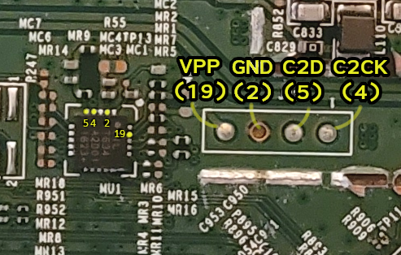

Gathering informations on MCU OTP C8051T634. The goal is to read its whole memory or to reprogram it.

# Advancement

I have been able to read some of the Program Memory, from address space 0x0000 to 0x1FFF, with **big limitations**.
Entropy analysis doesn't offer a clear-cut in favor of encrypted data, but extracted block is gibberish.
Also, from 0x0000 to 0x07FF (2048 bytes), the EPDAT register (used for verification of received data) indicates a write- and read-lock protection (`11000000`).
From 0x0800 to 0x1FFF (6144 bytes), the EPDAT register indicates write- and read-lock protection as well as an error reading (`11000001`).

As it is written in C8051T634 documentation, _a security byte in EPROM address space can be used to lock the program memory from being read or written across the C2 interface_.
This security byte is located at address `0x1fff`.
If only we could reset that byte to `11111111`.
Using UV-light on such a small area seems hopeless, but who knows?

## Reset an EPROM

From [Wikipedia](https://en.wikipedia.org/wiki/EPROM) we get that:

> Erasure of the EPROM begins to occur with wavelengths shorter than 400 nm. Exposure time for sunlight of one week or three years for room fluorescent lighting may cause erasure. The recommended erasure procedure is exposure to UV light at 253.7 nm of at least 15 Ws/cm2, usually achieved in 20 to 30 minutes with the lamp at a distance of about 2.5 cm.

# About C8051T634

Unordered notes from here.

- Manufacturer: Silicon Labs
- EPROM Size: 2048 bytes ([p.26](refs/C8051T63x-1397986.pdf))
- Family (DEVID): 0x17
- FPDAT Address:  0xb4
- Page Size:      512

## Memory organization

- Code memory
    - 0x0000 - 0x07FF : 2048 Bytes (2KiB) EPROM Memory
    - 0x0800 - 0x1FFE : Reserved
    - 0x1FFF : **Security byte**
- Data memory (internal RAM; RAM)
    - 0x00 - 0x1F : General purpose registers
    - 0x20 - 0x2F : Bit addressable
    - 0x30 - 0x7F : (Direct and Indirect Addressing)
    - 0x80 - 0xFF : Upper 128 RAM (Indirect addressing only) / Special Function Register's (SFR) (Direct addressing only)
- External Data Address Space (external RAM; XRAM)
    - 0x0000 - 0x01FF : XRAM - 512 Bytes (accessable using MOVX instruction)
    - 0x0200 - 0xFFFF : Same 512 bytes as from 0x0000 to 0x01FF, wrapped on 512-bytes boundaries

## Code memory storage

- Memory type: OTP
- Code memory can be erased and reprogrammed: **NO** (but we will take a look at this) ([p.3](refs/AN339.pdf))
- Programming voltage (VPP) required to program code memory: **YES**. VPP pin is 19.
    * Date Code 0935 and later: 5.75V < Needed voltage < 6.25V ([p.26](refs/C8051T63x-1397986.pdf)).
    * Date Code prior to 0935:  6.25V < Needed voltage < 6.5V  ([p.26](refs/C8051T63x-1397986.pdf)).

| Register name | Address | Source |
|:--------------|:-------:|:------:|
| FPCTL         | 0x02    | [p.26](refs/AN127.pdf) | 
| EPCTL         | 0xdf    |        |
| EPDAT         | 0xbf    |        |
| EPSTAT        | 0xb7    |        |
| EPADDRH       | 0xaf    |        |
| EPADDRL       | 0xae    |        |

| Device specific programming function | Function | Source |
|:--------------|:------:|:------:|
| Oscillator initialization | WriteSFR(0xb2, 0x83) | [p.28](refs/AN127.pdf) |

# C2 Interface

Performing EPROM programming functions (read/write) requires a PI (programming interface) to interact with the C2 interface (see [datasheet](https://eu.mouser.com/datasheet/2/368/C8051T63x-1397986.pdf) p.210).

My PI is an Arduino Uno loaded with [this code](basic-c2-arduino.ino) (wip) and connected to those pins (required basic soldering):

## Programming interface (PI)

> The Programming Interface (PI) performs a set of programming commands. Each command is executed using a sequence of reads and
writes of the FPDAT register. ([p.15](refs/AN127.pdf))

## Initializing PI

- drive C2CK low
- wait at least 20µs
- drive C2CK high
- wait at least 2µs
- perform an Address Write instruction targeting the FPCTL register (_in the [AN127](refs/AN127.pdf) they say 0x02, but for us it would rather be 0xb4_)
- perform a Data Write instruction sending a value of 0x02
- perform a Data Write instruction sending a value of 0x04 (to halt the core)
- perform a Data Write instruction sending a value of 0x01
- wait at least 20µs

## Read an EPROM block

[p.20](refs/AN127)

1.  Write 0x04 to the FPCTL register.
2.  Write 0x00 to EPCTL.
3.  Write 0x58 to EPCTL.
4.  Write the high byte of the address to EPADDRH.
5.  Write the low byte of the address to address EPADDRL.
6.  Perform an Address Write with a value of EPDAT.
7.  Perform Address Read instructions until the value returned is not 0x80 and the EPROM is no longer busy.
8.  Read the byte using the Data Read instruction.
9.  Repeat steps 7 and 8 until all bytes are read.
10. Write 0x40 to EPCTL.
11. Write 0x00 to EPCTL.
12. Write 0x02 to FPCTL.
13. Write 0x04 to FPCTL.
14. Write 0x01 to FPCTL.

## Programming commands (EPROM only)

Our MCU does not possess flash, only EPROM.

| Command | Code |
|:--------|:----:|
| Block write  | 0x07   |
| Block read  | 0x06   |
| Get version  | 0x01   |
| Get derivative  | 0x02   |
| Direct read  | 0x09   |
| Direct write  | 0x0A   |
| Indirect read  | 0x0B   |
| Indirect write  | 0x0C   |

# References

SILABS datasheets, tools and infos:

- [https://eu.mouser.com/datasheet/2/368/C8051T63x-1397986.pdf](https://eu.mouser.com/datasheet/2/368/C8051T63x-1397986.pdf) - (SILABS) C8051T634 datasheet
- [https://pccomponents.com/datasheets/SLL-C8051.pdf](https://pccomponents.com/datasheets/SLL-C8051.pdf) - (SILABS) SILABS MCUs sum up datasheet
- [https://www.silabs.com/documents/public/application-notes/AN127.pdf](https://www.silabs.com/documents/public/application-notes/AN127.pdf) - (SILABS) AN127 How to program the EPROM memory on MCU using C2 (C2 interface communication)
- [https://www.silabs.com/developers/8-bit-8051-microcontroller-software-studio?tab=downloads](https://www.silabs.com/developers/8-bit-8051-microcontroller-software-studio?tab=downloads) - (SILABS) Flashing softwares (free subscription required to download)
- [https://www.keil.com/dd/chip/5466.htm](https://www.keil.com/dd/chip/5466.htm) - Quick sum up

Non-official tools:

- [https://github.com/x893/C2.Flash](https://github.com/x893/C2.Flash) - C2.Flash (source code) seems to support T634 (contains Arduino code)
- [http://akb77.com/g/files/media/C2.Flash.rar](http://akb77.com/g/files/media/C2.Flash.rar) - C2.Flash.rar (contains C2.Flash.exe, from [here](http://akb77.com/g/silabs/jump-to-silabs-step-1/))
- [https://www.olliw.eu/2012/owsilprog/?en](https://www.olliw.eu/2012/owsilprog/?en) - owSilProg (Windows software) to flash SILABS MCUs & ESC
- [https://www.olliw.eu/2012/owsilprog-tutorials/#programmer](https://www.olliw.eu/2012/owsilprog-tutorials/#programmer) - owSilProg (Windows software) Tutorial
- [https://github.com/Guntermann-Drunck/c2tool](https://github.com/Guntermann-Drunck/c2tool) - [from the author](https://community.silabs.com/s/question/0D51M00007xeGSKSA2/announcing-linux-c2-flash-tool?language=fr): "c2tool in its first release is meant for programming slave controllers in embedded systems. But you could also use it to program form a Raspberry Pi". - original c2tool
- [https://github.com/merbanan/c2tool](https://github.com/merbanan/c2tool) - c2tool fork
- [https://github.com/dougy147/nb6vac/otp/c2tool-d147](https://github.com/dougy147/nb6vac/otp/c2tool-remastered-dougy147) - c2tool fork (my fixed install for newer binutils)
- [c2gen.ino](https://raw.githubusercontent.com/merbanan/c2gen/master/c2gen.ino) - Arduino code for c2tool fork
- [https://github.com/a1k0n/litex-c2](https://github.com/a1k0n/litex-c2) - Another tool for C2 interface
- [https://github.com/newtorah/c2prog](https://github.com/newtorah/c2prog) - Another C2 interface written in Go (supports only one chip but small info on how to add others)
- [https://github.com/iainguilliard/c2prog](https://github.com/iainguilliard/c2prog) - Arduino to flash another chip (based on some other tools here)
- [https://github.com/lhartmann/c2_prog_wifi](https://github.com/lhartmann/c2_prog_wifi) - WiFi-enabled programmer for Silicon Labs microcontrollers using the C2 programmer protocol, and to act as a serial-wifi bridge.
- [https://github.com/GBert/openwrt-misc](https://github.com/GBert/openwrt-misc) - OpenWrt misc tools (newer c2tool)
- [https://github.com/ee230/C8051F/tree/master/Examples/C8051T63x](https://github.com/ee230/C8051F/tree/master/Examples/C8051T63x) - Prepared C code for C8051T634 (?)
- [https://github.com/bird-sanctuary/arduino-c2-interface](https://github.com/bird-sanctuary/arduino-c2-interface) - Project for some kind of drone using Arduino and C2
- [https://github.com/jaydcarlson/c2-printf](https://github.com/jaydcarlson/c2-printf) - small utility that lets you do printf()-style debugging over a C2 debugger connection, for use with the Silicon Labs EFM8 and C8051F microcontrollers
- [https://github.com/RobusAsmCoder/SiLabs-Programmer](https://github.com/RobusAsmCoder/SiLabs-Programmer) - undocumented project. 
- [https://github.com/bryaq/owsilprog-flash](https://github.com/bryaq/owsilprog-flash) - Python CLI to flash SiLabs MCUs with owSilProg firmware based C2 programmer 

Close to our matter subjects:

- [https://github.com/debug-silicon/C8051F34x_Glitch](https://github.com/debug-silicon/C8051F34x_Glitch) - SiLabs C8051F34x code protection bypass 
- [https://community.silabs.com/s/question/0D58Y0000B4pthlSQA/cant-erase-c8051-microcontroller-using-arduino-not-getting-expected-0x0d-confirmation-value-any-insights-or-solutions?language=da](https://community.silabs.com/s/question/0D58Y0000B4pthlSQA/cant-erase-c8051-microcontroller-using-arduino-not-getting-expected-0x0d-confirmation-value-any-insights-or-solutions?language=da) - Question about programming C8051 with Arduino
- [https://hackaday.io/project/187734-convert-a-brushless-servo-into-a-stepper-motor/log/212102-programming-the-silabs-f330](https://hackaday.io/project/187734-convert-a-brushless-servo-into-a-stepper-motor/log/212102-programming-the-silabs-f330) - Program SILABS F330 (discuss C2 programming)
- [https://www.edn.com/the-hidden-world-of-mcu-start-up-code/](https://www.edn.com/the-hidden-world-of-mcu-start-up-code/) - About MCU start-up code
- [https://www.silabs.com/documents/public/application-notes/an1271-efr32-secure-key-storage.pdf](https://www.silabs.com/documents/public/application-notes/an1271-efr32-secure-key-storage.pdf) - (SILABS) AN1271 About secure key storage

EPROM physical transformations:

- [https://jcjc-dev.com/2020/10/20/learning-to-decap-ics/](https://jcjc-dev.com/2020/10/20/learning-to-decap-ics/) - Decapsulate integrated circuits
- [https://media.digikey.com/PDF/Data%20Sheets/ST%20Microelectronics%20PDFS/M27C512.pdf](https://media.digikey.com/PDF/Data%20Sheets/ST%20Microelectronics%20PDFS/M27C512.pdf) - EPROM recommanded erasure conditions (UV light, etc.)
- [https://charlesouweland.wordpress.com/2017/12/28/improvising-an-eprom-programmer/](https://charlesouweland.wordpress.com/2017/12/28/improvising-an-eprom-programmer/) - Improvising an EPROM programmer

Arduino:

- [https://forum.arduino.cc/t/digital-read-write-pinmode-fast-execution/89116](https://forum.arduino.cc/t/digital-read-write-pinmode-fast-execution/89116) - On fast execution pinmode (quick sum up about PORTB, DDRD, etc.)
